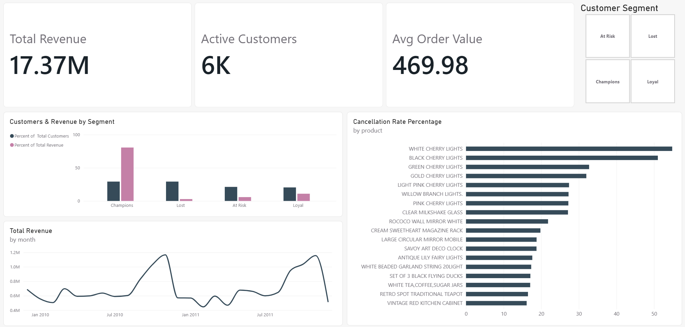

# Online Retail II — Customer Segmentation & Revenue Analysis

Which customers actually drive revenue for a UK online retailer, and which
segment is quietly slipping away? This project uses RFM (Recency, Frequency,
Monetary) segmentation and cohort retention analysis to answer that, built
on two years of real transaction data with a Power BI dashboard for
stakeholders.

## Business question

Which customer segment generates the most revenue, which segment is
shrinking fastest, and what should the business do about it?

## Dataset

[UCI Online Retail II](https://archive.ics.uci.edu/dataset/502/online+retail+ii)
— invoice-level transactions from a UK-based online gift retailer, December
2009 through December 2011 (~1M raw rows, ~798K after cleaning).

Fields include invoice number, product code/description, quantity, unit
price, customer ID, invoice date, and country. Invoices starting with "C"
indicate a cancellation.

## Tools

- **Python** (pandas, matplotlib, seaborn) — data cleaning, segmentation logic, cohort analysis
- **PostgreSQL** — RFM scoring and aggregation via SQL window functions
- **SQLAlchemy / psycopg2** — Python-to-Postgres connection
- **Power BI** — interactive dashboard

## Project structure

```
├── data/
│   └── raw_data/              # raw UCI Online Retail II source file
├── notebooks/
│   ├── 01_data_cleaning.ipynb       # load, clean, and write to Postgres
│   ├── 02_sql_analysis.ipynb        # RFM scoring, cancellation rate, monthly revenue (SQL)
│   └── 03_segmentation_python.ipynb # segment labeling, cohort retention, exports
├── outputs/
│   ├── rfm_customer_segments.csv
│   ├── segment_summary.csv
│   ├── monthly_revenue.csv
│   ├── cancellation_by_product.csv
│   ├── segment_size_vs_revenue.png
│   └── cohort_retention_heatmap.png
├── OnlineRetailDashboard.pbix  # Power BI dashboard
├── .env.example
└── README.md
```

## Process

1. **Clean the data (Python).** Loaded the raw multi-sheet export, dropped
   transactions missing a Customer ID (required for RFM), flagged
   cancellations rather than discarding them, removed invalid price rows,
   and loaded the cleaned table into PostgreSQL.

2. **Score customers with RFM (SQL).** Used `NTILE()` window functions to
   score every customer on recency, frequency, and monetary value, then
   combined the three scores into a total RFM score.

3. **Segment and analyze (Python).** Mapped RFM scores to four labeled
   segments — Champions, Loyal, At Risk, Lost — measured revenue
   concentration by segment, and built a monthly cohort retention model.

4. **Build the dashboard (Power BI).** KPI cards, a segment breakdown
   chart, a monthly revenue trend line, and a cancellation-rate view,
   filterable by customer segment.

## Key findings

- **Revenue concentration is extreme.** Champions make up only 29.2% of customers 
  but generate 80.6% of total revenue. Lost customers make up the same at 29.2% 
  but contribute just 2.8% of revenue. A relatively small, high-value group is 
  carrying the business, which makes retention of that specific segment a 
  higher priority than broad reactivation of the Lost segment.

- **At Risk (21.2% of customers, 5.8% of revenue) is worth watching closely**  
  These customers haven't fully disengaged like "Lost," but 
  aren't Loyal/Champion-level either. A targeted win-back campaign here has a 
  shorter path to revenue recovery than trying to reactivate Lost customers.

- **Cohort retention doesn't show a sharp one-time drop-off** it declines from 
  100% (month 0, by definition) to roughly 20-35% by month 1 and then stays 
  fairly stable in that 15-30% range for most cohorts through month 20+, rather 
  than decaying to near zero. This suggests customers who return at all tend to 
  stick around, so the bigger opportunity is converting more first-time buyers 
  into any repeat purchase, not just fighting long-term churn.

- **Earlier cohorts (Dec 2009) retained better than cohorts starting a few months 
  later** (Jan-Apr 2010 cohorts run roughly 5-15 points lower in month-1 retention) 
  worth noting, though the shorter observation window for later cohorts makes 
  this a weaker signal than the segment/revenue finding above.

- **Recommendation:** prioritize a Champions retention program (e.g., early access, 
  loyalty perks) given their outsized revenue share, and a targeted At Risk win-back 
  campaign (e.g., a discount or re-engagement email) rather than broad Lost-segment 
  outreach, since

## Setup / reproduction

1. Clone the repo and install dependencies:
   ```
   pip install pandas sqlalchemy psycopg2-binary python-dotenv matplotlib seaborn openpyxl
   ```
2. Download the [Online Retail II dataset](https://archive.ics.uci.edu/dataset/502/online+retail+ii)
   and place it in `data/raw_data/`.
3. Create a PostgreSQL database and add your credentials to a `.env` file
   (see `.env.example`):
   ```
   DB_USER=postgres
   DB_PASSWORD=yourpassword
   DB_HOST=localhost
   DB_PORT=5432
   DB_NAME=retail_portfolio
   ```
4. Run the notebooks in order: `01_data_cleaning.ipynb` →
   `02_sql_analysis.ipynb` → `03_segmentation_python.ipynb`.
5. Open `OnlineRetailDashboard.pbix` in Power BI Desktop, pointing at the
   CSVs in `outputs/`.

   ## Dashboard
 


